# Quick Order for Resellers

[分销商快速订单系统](http://jira.sstparts.com:8080/browse/QUOT-1534)

## Quick-Order/OMS erDiagram

### 1st Part

```mermaid
erDiagram
    QPriceTier ||--o{ QCustomerPricingGroup : has
    QCustomerPricingGroup ||--o{ QCustomerPricingGroupMember : has
    QCustomerPricingGroupMember ||--o{ QCustomer : has
    QCustomer ||--o{ QCustomerAddress : has
    QCustomerAddress O{--|| QCountryState : has
    QCountryState |{--|| QCountry : has
    QCustomer  ||--|| QCart : has
    QCart  ||--o{ QCartItem : has
    QCartItem  o{--|| Product_qa : is 
    QOrderItem  o{--|| Product_qa : is 
    QOrderPackageItem  o{--|| Product_qa : is 
    QCustomer  ||--o{ QOrder : has
    QOrder  ||--o{ QOrderItem : has
    QOrder  ||--o{ QOrderEvent : has
    QOrder  ||--o{ QOrderPackage : has
    QOrderPackage  ||--o{ QOrderPackageItem : has
    Product_qa  ||--o{ QProductInventory : has
    QProductInventory  ||--o{ QProductInventoryTx : has
    

    QCustomerPricingGroup {
        integer id_pk
        string name
        string note
        number created_by
        number updated_by
    }


    QCustomerPricingGroupMember {
        integer id_pk
        string name
        string note
        number created_by
        number updated_by
    }    

    QPriceTier {
        integer id_pk
        string name
        string note
        number created_by
        number updated_by
    }    


    QCustomer {
        integer id_pk
        string name
        string note
        number created_by
        number updated_by
        integer customer_group_id_fk
    }
    

    QCustomerAddress {
        integer id_pk
        string name
        string note
        string country
        string city
        string zip
        number created_by
        number updated_by
    }


    QCountryState {
        integer id_pk
        string name
        string note
        string country
        string city
        string zip
        number created_by
        number updated_by
    }

    QCountry {
        integer id_pk
        string name
        string note
        string code 
        number created_by
        number updated_by
    }
   
    QCart {
        integer id_pk
        string customer_id
        string name
        string note
        string shipping_address
        string billing_address
        string po_number
        string comment
        string payment_type
        string shipping_method
        number created_by
        number updated_by
    } 

    QCartItem {
        integer id_pk
        string name
        string note
        string product_id
        number qty
        number price
        number sub_total
        number created_by
        number updated_by
    } 

    QOrder {
        integer id_pk
        string customer_id
        string order_number
        string name
        string note
        number created_by
        number updated_by
    }

    QOrderItem {
        integer id_pk
        string name
        string note
        string product_id
        number qty
        number price
        number sub_total
        number created_by
        number updated_by
    } 
    QOrderEvent {
        integer id_pk
        string name
        string note
        json order_detail
        json biz_detail
        number created_by
        number updated_by
    } 
    QOrderPackage {
        integer id_pk
        string order_number
        string name
        string note
        number created_by
        number updated_by
    } 
    QOrderPackageItem {
        integer id_pk
        string package_number
        string product_name
        string product_id
        number quantity
        number created_by
        number updated_by
    }   
    

    Product_qa{
        integer id_pk
        string name
        string note
        number created_by
        number updated_by
    } 


    QProductInventory{
        integer id_pk
        number product_id
        string warehouse
        number saleable_quantity
        number created_by
        number updated_by
    } 


    QProductInventoryTx{
        integer id_pk
        number product_id
        string warehouse
        string action
        number quantity
        jsonb biz_detail
        number created_by
        number updated_by
    } 
    
```

### 2nd Part

```mermaid
erDiagram
   
    QWallet  ||--o{ QWalletTx : has
    QOrder   ||--o{ QDebitMemo : has

    QPayment  o{--|| QPaymentPayPal : is
    QPayment  o{--|| QPaymentCreditCard : is
    QPayment  o{--|| QPaymentBankTransfer : is   
    QPayment  o{--|| QPaymentCash : is   
    
    QCashInOrder   ||--o{ QPayment : has
    QCashOutOrder  ||--o{ QPayment : has
    QSaygoodOrder  ||--o{ QPayment : has   
    QRMAOrder      ||--o{ QPayment : has
    QRefundOrder   ||--o{ QPayment : has
    QDebitMemo     ||--o{ QPayment : has   
    QOrder         ||--o{ QPayment : has   
    
    QWalletTx  o{--|| QCashInOrder : has
    QWalletTx  o{--|| QCashOutOrder : has
    QWalletTx  o{--|| QSaygoodOrder : has
    QWalletTx  o{--|| QRMAOrder : has
    QWalletTx  o{--|| QRefundOrder : has
    QWalletTx  o{--|| QDebitMemo : has 
  

    
    QWallet {
        integer id_pk
        string customer_id
        string wallet_number
        string name
        string note
        number balance
        number points
        number gift
        number created_by
        number updated_by
    } 

    QWalletTx {
        integer id_pk
        string customer_id
        string name
        string note
        number amount
        number point
        number gift

        string biz_order_type
        string biz_order_id
        number created_by
        number updated_by
    } 


    QPayment {
        integer id_pk
        string customer_from
        string customer_to
        string name
        string note
        string biz_order_type
        string biz_order_id
        string payment_type
        number payment_id
        number amount
        number created_by
        number updated_by
    } 

    QPaymentPayPal {
        integer id_pk
        string name
        string note
        number amount
        json biz_order_type_and_order_id
        number created_by
        number updated_by
    } 

    QPaymentCreditCard {
        integer id_pk
        string name
        string note
        number amount
        json biz_order_type_and_order_id
        number created_by
        number updated_by
    } 
    QPaymentBankTransfer {
        integer id_pk
        string name
        string note
        number amount
        json biz_order_type_and_order_id
        number created_by
        number updated_by
    } 

    QPaymentCash {
        integer id_pk
        string name
        string note
        number amount
        json biz_order_type_and_order_id
        number created_by
        number updated_by
    } 
    
    QCashOutOrder {
        integer id_pk
        string name
        string note
        string status
        number created_by
        number updated_by
    } 
      
    QCashInOrder {
        integer id_pk
        string name
        string note
        string status
        number created_by
        number updated_by
    } 
      
    QRMAOrder {
        integer id_pk
        string name
        string note
        string status
        number created_by
        number updated_by
    } 

       
    QRefundOrder {
        integer id_pk
        string name
        string note
        string status
        number created_by
        number updated_by
    } 


    QSaygoodOrder {
        integer id_pk
        string name
        string note
        string status
        number created_by
        number updated_by
    } 
  
  
    QDebitMemo {
        integer id_pk
        string name
        string note
        string status
        number created_by
        number updated_by
    } 


    QOrder {
        integer id_pk
        string customer_id
        string order_number
        string name
        string note
        string status
        number created_by
        number updated_by
    }

    
```

## [Customer](#table-index) 

> 客户表
>

### qcustomer

> 客户资料信息
>

| No. | English Name      | Field Type | Chinese Name | Description                              |
|-----|-------------------|------------|--------------|------------------------------------------|
| 1   | customer_id       | String     | 客户编号         | Unique identifier for the customer       |
| 2   | name              | String     | 姓名           | Customer's name                          |
| 3   | gender            | String     | 性别           | Customer's gender                        |
| 4   | birthdate         | Date       | 出生日期         | Customer's date of birth                 |
| 5   | phone_number      | String     | 联系电话         | Customer's phone number                  |
| 6   | email_address     | String     | 电子邮件         | Customer's email address                 |
| 7   | address           | String     | 地址           | Customer's address                       |
| 8   | customer_group_id | String     | 客户分组编号       | Unique identifier for the Customer Group |

### qcustomer_pricing_group_member

> (客户与价格分组多对多)
>

| No. | English Name      | Field Type | Chinese Name | Description                              |
|-----|-------------------|------------|--------------|------------------------------------------|
| 1   | customer_group_id | String     | 客户分组编号       | Unique identifier for the customer group |
| 2   | name              | String     | 姓名           | Customer's name                          |
| 3   | customer_id       | Integer    | 客户编号         | Unique identifier for the Customer       |

### qcustomer_pricing_group

> 客户价格策略分组资料信息
>

| No. | English Name  | Field Type | Chinese Name        | Description                              |
|-----|---------------|------------|---------------------|------------------------------------------|
| 1   | id            | String     | 客户分组编号              | Unique identifier for the customer group |
| 2   | name          | String     | 姓名                  | Customer's name                          |
| 3   | price_tier_id | Integer    | Qprice Tier ID (FK) | Unique identifier for the Qprice Tier    |

### qcustomer_address

> 客户地址信息
>

| No. | English Name | Field Type   | Chinese Name | Description                                   |
|-----|--------------|--------------|--------------|-----------------------------------------------|
| 1   | address_id   | INT          | 地址编号         | Primary key                                   |
| 2   | customer_id  | INT          | 客户编号         | Foreign key referencing Customer(customer_id) |
| 3   | street       | VARCHAR(255) | 街道           | Street address                                |
| 4   | city         | VARCHAR(255) | 城市           | City                                          |
| 5   | state        | VARCHAR(2)   | 州/省          | State or province                             |
| 6   | zip_code     | VARCHAR(10)  | 邮政编码         | Zip or postal code                            |
| 7   | country      | VARCHAR(255) | 国家           | Country                                       |
| 8   | nick_name    | VARCHAR(255) | 地址昵称         | Address NickName                              |

### 国家表：countries 、国家州表：COUNTRY_STATES

参照 [国家表：countries 、国家州表：COUNTRY_STATES](http://wiki.sstparts.com:8090/pages/viewpage.action?pageId=917777)

## [Qcart](#table-index) 

> 购物车
>

### qcart

> 购物车汇总信息
>

| No. | English Name                         | Field Type | Chinese Name | Description                                                   |
|-----|--------------------------------------|------------|--------------|---------------------------------------------------------------|
| 1   | cart_id                              | INTEGER    | 购物车编号        | Unique identifier for the shopping cart                       |
| 2   | customer_id                          | String     | 客户编号         | Unique identifier for the customer                            |
| 3   | date_created                         | Date/Time  | 创建日期/时间      | Date and time when the cart was created                       |
| 4   | total_items                          | Integer    | 总商品数         | Total number of items in the cart                             |
| 5   | total_cost                           | Decimal    | 总费用          | Total cost of the items in the cart                           |
| 6   | shipping_cost                        | Decimal    | 运费           | Shipping cost for the items in the cart                       |
| 7   | tax                                  | Decimal    | 税费           | Tax applied to the items in the cart                          |
| 8   | discount                             | Decimal    | 折扣           | Discount applied to the items in the cart                     |
| 9   | total_cost_after_discounts_and_taxes | Decimal    | 折后总费用（含税）    | Total cost of the items in the cart after discounts and taxes |

### qcart_Items

> 购物车商品明细
>

| No. | English Name | Field Type | Chinese Name | Description                                                        |
|-----|--------------|------------|--------------|--------------------------------------------------------------------|
| 1   | cart_item_id | INTEGER    | 购物车商品编号      | Unique identifier for the cart item                                |
| 2   | cart_id      | String     | 购物车编号        | Unique identifier for the shopping cart                            |
| 3   | product_id   | String     | 产品编号         | Unique identifier for the product                                  |
| 4   | quantity     | Integer    | 数量           | Quantity of the product in the cart                                |
| 5   | price        | Decimal    | 价格           | Price of the product in the cart                                   |
| 6   | discount     | Decimal    | 折扣           | Discount applied to the product in the cart                        |
| 7   | subtotal     | Decimal    | 小计           | Subtotal for the product in the cart (quantity * price - discount) |
| 10  | on_cart      | Boolean    | 在购物车         | 在购物车内                                                              |
| 11  | on_later     | Boolean    | 在Save4Later  | 在Save4Later清单内                                                     |

## [Qorder](#table-index) 

> 订单
>

### qorder

> 订单汇总信息,其他详细字段参照 http://wiki.sstparts.com:8090/plugins/viewsource/viewpagesrc.action?pageId=917777
>

| No. | English Name     | Field Type | Chinese Name | Description                                                                          |
|-----|------------------|------------|--------------|--------------------------------------------------------------------------------------|
| 1   | order_id         | INTEGER    | 订单编号         | Primary key                                                                          |
| 2   | version_at       | INTEGER    | 事件编号         | Primary key(Foreign Key)                                                             |
| 3   | customer_id      | INTEGER    | 客户编号         | Foreign key                                                                          |
| 4   | order_date       | DATE       | 订单日期         |                                                                                      |
| 5   | total_price      | REAL       | 总价           |                                                                                      |
| 6   | shipping_address | JSON       | 邮寄地址         |                                                                                      |
| 7   | billing_address  | JSON       | 账单地址         |                                                                                      |
| 8   | payment_method   | TEXT       | 支付方式         | 2: PayPal, 4: bank transfer, 7: wallet                                               |
| 9   | shipping_method  | TEXT       | 配送方式         |                                                                                      |
| 10  | orderStatus      | TEXT       | 订单状态         | 1 Started, 2 Completed, 3 Approved, 4 Cancelled, 5 Finished                          |
| 11  | orderNote        | TEXT       | 备注           |                                                                                      |
| 11  | orderNote        | TEXT       | 备注           | 参照 http://wiki.sstparts.com:8090/plugins/viewsource/viewpagesrc.action?pageId=917777 |
| 11  | orderNote        | TEXT       | 备注           | 参照 http://wiki.sstparts.com:8090/plugins/viewsource/viewpagesrc.action?pageId=917777 |
| 11  | orderNote        | TEXT       | 备注           | 参照 http://wiki.sstparts.com:8090/plugins/viewsource/viewpagesrc.action?pageId=917777 |
| 11  | orderNote        | TEXT       | 备注           | 参照 http://wiki.sstparts.com:8090/plugins/viewsource/viewpagesrc.action?pageId=917777 |

unique: order_id + version_at

### qorder_items

> 订单商品明细,其他详细字段参照 http://wiki.sstparts.com:8090/plugins/viewsource/viewpagesrc.action?pageId=917777
>

| No. | English Name      | Field Type | Chinese Name | Description                                                                           |
|-----|-------------------|------------|--------------|---------------------------------------------------------------------------------------|
| 1   | order_item_id     | INTEGER    | 订单项编号        | Primary key                                                                           |
| 2   | order_id          | INTEGER    | 订单编号         | Foreign key                                                                           |
| 3   | version_at        | INTEGER    | 事件编号         | Foreign Key                                                                           |
| 4   | product_id        | INTEGER    | 商品编号         | Foreign key                                                                           |
| 5   | quantity          | INTEGER    | 数量           |                                                                                       |
| 6   | unit_price        | REAL       | 单价           |                                                                                       |
| 7   | subtotal          | REAL       | 小计           |                                                                                       |
| 8   | orderInPrice      | REAL       | 进货单价         | 参照  http://wiki.sstparts.com:8090/plugins/viewsource/viewpagesrc.action?pageId=917777 |
| 9   | orderProductPrice | REAL       | 出售单价格        | 参照  http://wiki.sstparts.com:8090/plugins/viewsource/viewpagesrc.action?pageId=917777 |
| 9   | orderProductPrice | REAL       | 出售单价格        | 参照  http://wiki.sstparts.com:8090/plugins/viewsource/viewpagesrc.action?pageId=917777 |
| 9   | orderProductPrice | REAL       | 出售单价格        | 参照  http://wiki.sstparts.com:8090/plugins/viewsource/viewpagesrc.action?pageId=917777 |
| 9   | orderProductPrice | REAL       | 出售单价格        | 参照  http://wiki.sstparts.com:8090/plugins/viewsource/viewpagesrc.action?pageId=917777 |

### qorder_events

> 订单变更明细，类似钱包流水明细,oms改动历史事件
>

| No. | English Name          | Field Type | Chinese Name | Description                                    |
|-----|-----------------------|------------|--------------|------------------------------------------------|
| 1   | event_id              | INTEGER    | 事件编号         | Primary                                        |
| 2   | order_id              | INTEGER    | 订单编号         | Foreign                                        |
| 3   | event_type            | ENUM       | 事件类型         | Type of event (e.g. 修改送货地址、修改配送方式、修改支付方式、增减商品) |
| 4   | event_timestamp       | STRING     | 事件时间         |                                                |
| 5   | event_details         | JSON       | 当前事件详情       | detail(e.g. 新配送方式、新支付方式、增减商品条目)                |
| 6   | event_text            | TEXT       | 当前事件详情       | event details in text                          |
| 7   | order_details         | JSON       | 当前订单详细内容快照   | order                                          |
| 8   | order_status          | INTEGER    | 当前订单状态       | order status                                   |
| 9   | order_shipping_status | INTEGER    | 当前订单状态       | order shipping status                          |
| 10  | order_payment_status  | INTEGER    | 当前订单状态       | order details                                  |

### qorder_package

> 订单包裹
>

| No. | English Name    | Field Type | Chinese Name | Description |
|-----|-----------------|------------|--------------|-------------|
| 1   | package_id      | INTEGER    | 包裹编号         | Primary key |
| 2   | order_id        | INTEGER    | 订单编号         | Foreign key |
| 3   | package_type    | ENUM       | 包裹类型         | Type of 包裹  |
| 4   | package_status  | ENUM       | 包裹类型         | Type of 包裹  |
| 4   | shipping_status | ENUM       | 包裹类型         | Type of 包裹  |
| 4   | tracking_number | ENUM       | 包裹类型         | Type of 包裹  |
| 6   | created_by      | TEXT       | NOT NULL     | 创建人         | 创建人        |
| 6   | create_time     | TEXT       | NOT NULL     | 创建时间        | 创建时间        |
| 7   | update_by       | TEXT       | NOT NULL     | 更新人         | 更新人        |
| 7   | update_time     | TEXT       | NOT NULL     | 更新时间        | 更新时间        |

### qorder_package_items

> 订单包裹商品明细
>

| No. | English Name    | Field Type | Chinese Name | Description |
|-----|-----------------|------------|--------------|-------------|
| 1   | package_item_id | INTEGER    | 订单项编号        | Primary key |
| 2   | package_id      | INTEGER    | 订单编号         | Foreign key |
| 4   | product_id      | INTEGER    | 商品编号         | Foreign key |
| 4   | product_name    | STRING     | 商品名称         | Foreign key |
| 5   | quantity        | INTEGER    | 数量           |             |

### QProduct_Inventory

> 产品库存表（多仓）
>

| No. | English Name      | Field Type | Chinese Name | Description |
|-----|-------------------|------------|--------------|-------------|
| 1   | item_id           | INTEGER    | 产品编号         | Primary key |
| 2   | warehouse         | STRING     | 仓库编号         | Foreign key |
| 5   | saleable_quantity | INTEGER    | 可卖数量         |             |

### QProduct_Inventory_Transaction

> 产品库存表流水
>

| No. | English Name | Field Type | Chinese Name          | Description |
|-----|--------------|------------|-----------------------|-------------|
| 1   | item_id      | INTEGER    | 产品编号                  | Primary key |
| 2   | warehouse    | STRING     | 仓库编号                  |             |
| 2   | action       | STRING     | 加减数量                  |             |
| 5   | quantity     | INTEGER    | 可卖数量                  |             |
| 5   | biz_detail   | JSON       | 业务信息(orderid,补充库存、扣减) |             |

### PaymentTransaction

> no need ,use wallet/wallet_tx instead
> 总的支付交易(聚合索引)
>

| No. | Column Name    | Data Type | Constraints                | Chinese Name                        | Description |
|-----|----------------|-----------|----------------------------|-------------------------------------|-------------|
| 1   | tx_id          | INTEGER   | PRIMARY KEY, AUTOINCREMENT | ID                                  | ID          |
| 2   | customer_id    | INTEGER   | NOT NULL                   | 客户ID                                | ID          |
| 3   | payment_id     | TEXT      | NOT NULL                   | 支付ID                                | 支付ID        |
| 4   | type           | TEXT      | NOT NULL                   | Paypal,credit,wallet,point          |             |
| 5   | amout 100      | TEXT      | NOT NULL                   | Paypal,credit,wallet,point          |             |
| 5   | biz_detail     | TEXT      | NOT NULL                   | (orderid,debit_id，提现，封口费)           |             |
| 6   | payment_detail | JSON      | NOT NULL                   | PaypalPayment,credit结果,wallet,point |             |

### PaymentTransaction_Detail

> no need ,use wallet/wallet_tx instead
>

| No. | Column Name | Data Type | Constraints                     | Chinese Name | Description |
|-----|-------------|-----------|---------------------------------|--------------|-------------|
| 1   | tx_id       | INTEGER   | PRIMARY KEY, AUTOINCREMENT      | ID           | ID          |
| 2   | biz_detail  | INTEGER   | NOT NULL    005order   debit003 | bizID        | ID          |
| 3   | amount      | INTEGER   | NOT NULL    50           50     | bizID        | ID          |
| 3   | type        | INTEGER   | NOT NULL    order/debit         | bizID        | ID          |

### PayPalPayment

> PayPal 支付实际结果
>

| No. | Column Name | Data Type | Constraints                | Chinese Name | Description |
|-----|-------------|-----------|----------------------------|--------------|-------------|
| 1   | id          | INTEGER   | PRIMARY KEY, AUTOINCREMENT | ID           | ID          |
| 1   | customer_id | INTEGER   | NOT NULL                   | 客户ID         | ID          |
| 2   | payment_id  | TEXT      | NOT NULL                   | 支付ID         | 支付ID        |
| 3   | intent      | TEXT      | NOT NULL                   | 意图           | 意图          |
| 4   | state       | TEXT      | NOT NULL                   | 状态           | 状态          |
| 5   | cart        | TEXT      |                            | 购物车          | 购物车         |
| 6   | created_by  | TEXT      | NOT NULL                   | 创建人          | 创建人         |
| 6   | create_time | TEXT      | NOT NULL                   | 创建时间         | 创建时间        |
| 7   | update_by   | TEXT      | NOT NULL                   | 更新人          | 更新人         |
| 7   | update_time | TEXT      | NOT NULL                   | 更新时间         | 更新时间        |

### CreditCardPayment

> CreditCard 支付实际结果
>

| No. | Column Name | Data Type | Constraints                | Chinese Name | Description |
|-----|-------------|-----------|----------------------------|--------------|-------------|
| 1   | id          | INTEGER   | PRIMARY KEY, AUTOINCREMENT | ID           | ID          |
| 1   | customer_id | INTEGER   | NOT NULL                   | 客户ID         | ID          |
| 2   | payment_id  | TEXT      | NOT NULL                   | 支付ID         | 支付ID        |
| 3   | intent      | TEXT      | NOT NULL                   | 意图           | 意图          |
| 4   | state       | TEXT      | NOT NULL                   | 状态           | 状态          |
| 5   | cart        | TEXT      |                            | 购物车          | 购物车         |
| 6   | created_by  | TEXT      | NOT NULL                   | 创建人          | 创建人         |
| 6   | create_time | TEXT      | NOT NULL                   | 创建时间         | 创建时间        |
| 7   | update_by   | TEXT      | NOT NULL                   | 更新人          | 更新人         |
| 7   | update_time | TEXT      | NOT NULL                   | 更新时间         | 更新时间        |

### BankTransferPayment

> BankTransfer 支付实际结果
>

| No. | Column Name | Data Type | Constraints                | Chinese Name | Description |
|-----|-------------|-----------|----------------------------|--------------|-------------|
| 1   | id          | INTEGER   | PRIMARY KEY, AUTOINCREMENT | ID           | ID          |
| 1   | customer_id | INTEGER   | NOT NULL                   | 客户ID         | ID          |
| 2   | payment_id  | TEXT      | NOT NULL                   | 支付ID         | 支付ID        |
| 3   | intent      | TEXT      | NOT NULL                   | 意图           | 意图          |
| 4   | state       | TEXT      | NOT NULL                   | 状态           | 状态          |
| 5   | cart        | TEXT      |                            | 购物车          | 购物车         |
| 6   | created_by  | TEXT      | NOT NULL                   | 创建人          | 创建人         |
| 6   | create_time | TEXT      | NOT NULL                   | 创建时间         | 创建时间        |
| 7   | update_by   | TEXT      | NOT NULL                   | 更新人          | 更新人         |
| 7   | update_time | TEXT      | NOT NULL                   | 更新时间         | 更新时间        |

### billingorders

这部分等OMS需求功能后参考billing 的表设计paypal 支付， credit card 支付相关表

### payment

这部分等OMS需求功能后参考billing 的表设计paypal 支付， credit card 支付相关表

### billingpayment

这部分等OMS需求功能后参考billing 的表设计paypal 支付， credit card 支付相关表

### billingpaymentitem

这部分等OMS需求功能后参考billing 的表设计paypal 支付， credit card 支付相关表

### BillingPaymentLink

这部分等OMS需求功能后参考billing 的表设计paypal 支付， credit card 支付相关表

### BillingPaymentPayer

这部分等OMS需求功能后参考billing 的表设计paypal 支付， credit card 支付相关表

### BillingPaymentTrasaction

这部分等OMS需求功能后参考billing 的表设计paypal 支付， credit card 支付相关表

### BillingRefund

这部分等OMS需求功能后参考billing 的表设计paypal 支付， credit card 支付相关表

## [Qwallet](#table-index) 

> 钱包，一个客户可能有多个不同类型的钱包，一个类型至多一个钱包
>

### QWallet

| No. | English Name | Field Type | Chinese Name | Description                                               |
|-----|--------------|------------|--------------|-----------------------------------------------------------|
| 1   | wallet_id    | INTEGER    | 钱包ID         | Unique identifier for the wallet (PK)                     |
| 2   | user_id      | INTEGER    | 用户ID         | Unique identifier for the user associated with the wallet |
| 4   | balance      | FLOAT      | 当前余额         | Current balance of deposited money in the wallet          |
| 4   | points       | FLOAT      | 当前积分         | Current balance of points in the wallet                   |
| 4   | gift         | FLOAT      | 当前赠送积分       | Current balance of gift in the wallet                     |
| 5   | version_at   | INTEGER    | 当前版本@tx_id   | tx_id wallet_tx (PK)                                      |

unique: wallet_id + version_at

### QWallet_tx (Log)

> 钱包流水明细，包括但不限于：
> 4、增加积分流水
> 5、增加送积分

| No. | English Name | Field Type | Chinese Name | Description                                                      |
|-----|--------------|------------|--------------|------------------------------------------------------------------|
| 1   | tx_id        | INTEGER    | 交易ID         | Unique identifier for the transaction                            |
| 2   | user_id      | INTEGER    | 用户ID         | Unique identifier for the user associated with the wallet        |
| 2   | wallet_id    | INTEGER    | 钱包ID         | Unique identifier for the wallet associated with the transaction |
| 3   | type         | ENUM       | 类型           | Type of wallet (e.g. money, points,debit_memo)                   |
| 3   | amount       | FLOAT      | 金额           | Amount of the transaction                                        |
| 4   | points       | FLOAT      | 积分           | Type of transaction (e.g. deposit充值, withdrawal取现,封口费,订单欠款，退款)   |
| 5   | tx_timestamp | STRING     | 交易时间戳        | Date and time of the transaction                                 |
| 6   | biz_detail   | JSON       | 业务明细         | business detail(e.g. order_id, paypal_tx_id, 封口费notes,提现)        |

### QSaygoodOrder

> 封口单

| No. | English Name | Field Type | Chinese Name | Description                            |
|-----|--------------|------------|--------------|----------------------------------------|
| 1   | id           | INTEGER    | 交易ID         | Unique identifier for the SaygoodOrder |
| 2   | field1       | TEXT       | 业务明细字段1      |                                        |
| 3   | field2       | TEXT       | 业务明细字段2      |                                        |
| 4   | field3       | TEXT       | 业务明细字段3      |                                        |

### QRMAOrder

> 退货单
>

| No. | English Name | Field Type | Chinese Name | Description                        |
|-----|--------------|------------|--------------|------------------------------------|
| 1   | id           | INTEGER    | 交易ID         | Unique identifier for the RMAOrder |
| 2   | field1       | TEXT       | 业务明细字段1      |                                    |
| 3   | field2       | TEXT       | 业务明细字段2      |                                    |
| 4   | field3       | TEXT       | 业务明细字段3      |                                    |

### QRefundOrder

> 退款单单
>

| No. | English Name | Field Type | Chinese Name | Description                           |
|-----|--------------|------------|--------------|---------------------------------------|
| 1   | id           | INTEGER    | 交易ID         | Unique identifier for the RefundOrder |
| 2   | field1       | TEXT       | 业务明细字段1      |                                       |
| 3   | field2       | TEXT       | 业务明细字段2      |                                       |
| 4   | field3       | TEXT       | 业务明细字段3      |                                       |

### QCashInOrder

> 充值单
>

| No. | English Name | Field Type | Chinese Name | Description                           |
|-----|--------------|------------|--------------|---------------------------------------|
| 1   | id           | INTEGER    | 交易ID         | Unique identifier for the CashInOrder |
| 2   | field1       | TEXT       | 业务明细字段1      |                                       |
| 3   | field2       | TEXT       | 业务明细字段2      |                                       |
| 4   | field3       | TEXT       | 业务明细字段3      |                                       |

### QCashoutOrder

> 提现单
>

| No. | English Name | Field Type | Chinese Name | Description                        |
|-----|--------------|------------|--------------|------------------------------------|
| 1   | cashout_id   | INTEGER    | 提现ID         | Unique identifier for the cashout  |
| 2   | customer_id  | INTEGER    | 客户ID         | Unique identifier for the Customer |
| 3   | money_amount | FLOAT      | 提现金额         | Amount of the cashout              |
| 4   | point_amout  | FLOAT      | 扣减积分         | Amount of the points deduct        |
| 6   | created_by   | TEXT       | 创建人          | 创建人                                |
| 6   | create_time  | TEXT       | 创建时间         | 创建时间                               |
| 7   | update_by    | TEXT       | 更新人          | 更新人                                |
| 7   | update_time  | TEXT       | 更新时间         | 更新时间                               |

### QDebitMemo

> 订单支付后由于改单导致的客户欠sst的款项
>

| No. | English Name | Field Type | Chinese Name | Description                        |
|-----|--------------|------------|--------------|------------------------------------|
| 1   | debit_id     | INTEGER    | 欠款ID         | Unique identifier for the debit    |
| 2   | customer_id  | INTEGER    | 客户ID         | Unique identifier for the Customer |
| 3   | amount       | FLOAT      | 金额           | Amount of the debit                |
| 3   | order_id     | INTEGER    | 订单ID         | Unique identifier for the Order    |
| 4   | biz_detail   | JSON       | 业务明细         | business detail(e.g. order_id)     |
| 5   | status       | STRING     | 状态           | 还款状态（已还、未还）                        |
| 5   | payment_info | STRING     | 还款支付信息       | 还款支付信息                             |
| 6   | created_by   | TEXT       | 创建人          | 创建人                                |
| 6   | create_time  | TEXT       | 创建时间         | 创建时间                               |
| 7   | update_by    | TEXT       | 更新人          | 更新人                                |
| 7   | update_time  | TEXT       | 更新时间         | 更新时间                               |

