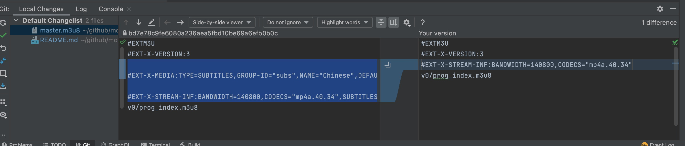

# Link
```shell
cd ~/github/moreadgroup/moread-cloud-functions/domain-task/src/main/resources/

ln -s ~/github/moreadgroup/moread-cloud-data/src/main/resources/listens listens

```

# install webvtt tools
```html
$ cd magic-ear-8-times 
$ npm i node-webvtt-youtube

```
# Playlist Introduction
## gen media hls
```shell
cd listens/magic-ear-8-times/introduction/

sh ../genhls.sh introduction 1
sh ../genhls.sh introduction 2 
sh ../genhls.sh introduction 3
```
** Please git compare master.m3u8 and then revert with olds

## Generate draft webvtt
```
Run Test: MagicEar8TimesTest.testParseFromAliaiJson2VttThenOK()
```
## Segment subtile webvtt
```shell
cd listens/magic-ear-8-times/introduction/

../node_modules/node-webvtt-youtube/bin/webvtt-segment.js -v --target-duration 10 -o ./1/subtitles/zh introduction-1.webvtt

../node_modules/node-webvtt-youtube/bin/webvtt-segment.js -v --target-duration 10 -o ./2/subtitles/zh introduction-2.webvtt

../node_modules/node-webvtt-youtube/bin/webvtt-segment.js -v --target-duration 10 -o ./3/subtitles/zh introduction-3.webvtt


```
# Playlist Primary 
## gen media hls
```shell
cd listens/magic-ear-8-times/primary/

sh ../genhls.sh primary 1

sh ../genhls.sh primary 2 

sh ../genhls.sh primary 3

sh ../genhls.sh primary 4 

sh ../genhls.sh primary 5

sh ../genhls.sh primary 6

sh ../genhls.sh primary 7

sh ../genhls.sh primary 8


```
## Generate draft webvtt
```
Run Test: MagicEar8TimesTest.testParseFromAliaiJson2VttThenOK()
```
## Segment subtile webvtt
```shell
cd listens/magic-ear-8-times/primary/

../node_modules/node-webvtt-youtube/bin/webvtt-segment.js -v --target-duration 10 -o ./1/subtitles/zh primary-1.webvtt
../node_modules/node-webvtt-youtube/bin/webvtt-segment.js -v --target-duration 10 -o ./2/subtitles/zh primary-2.webvtt
../node_modules/node-webvtt-youtube/bin/webvtt-segment.js -v --target-duration 10 -o ./3/subtitles/zh primary-3.webvtt
../node_modules/node-webvtt-youtube/bin/webvtt-segment.js -v --target-duration 10 -o ./4/subtitles/zh primary-4.webvtt
../node_modules/node-webvtt-youtube/bin/webvtt-segment.js -v --target-duration 10 -o ./5/subtitles/zh primary-5.webvtt
../node_modules/node-webvtt-youtube/bin/webvtt-segment.js -v --target-duration 10 -o ./6/subtitles/zh primary-6.webvtt
../node_modules/node-webvtt-youtube/bin/webvtt-segment.js -v --target-duration 10 -o ./7/subtitles/zh primary-7.webvtt
../node_modules/node-webvtt-youtube/bin/webvtt-segment.js -v --target-duration 10 -o ./8/subtitles/zh primary-8.webvtt


```


# Playlist Junior 
## gen junior's hls
```shell
cd junior

sh ../genhls.sh junior 01
sh ../genhls.sh junior 02 
sh ../genhls.sh junior 03

...

sh ../genhls.sh junior 20 
sh ../genhls.sh junior 21
```
## Generate draft webvtt
```
Run Test: MagicEar8TimesTest.testParseFromAliaiJson2VttThenOK()
```
## Segment subtile webvtt
```shell
cd listens/magic-ear-8-times/junior/

../node_modules/node-webvtt-youtube/bin/webvtt-segment.js -v --target-duration 10 -o ./01/subtitles/zh junior-01.webvtt
../node_modules/node-webvtt-youtube/bin/webvtt-segment.js -v --target-duration 10 -o ./02/subtitles/zh junior-02.webvtt
../node_modules/node-webvtt-youtube/bin/webvtt-segment.js -v --target-duration 10 -o ./03/subtitles/zh junior-03.webvtt
../node_modules/node-webvtt-youtube/bin/webvtt-segment.js -v --target-duration 10 -o ./04/subtitles/zh junior-04.webvtt
../node_modules/node-webvtt-youtube/bin/webvtt-segment.js -v --target-duration 10 -o ./05/subtitles/zh junior-05.webvtt
../node_modules/node-webvtt-youtube/bin/webvtt-segment.js -v --target-duration 10 -o ./06/subtitles/zh junior-06.webvtt
../node_modules/node-webvtt-youtube/bin/webvtt-segment.js -v --target-duration 10 -o ./07/subtitles/zh junior-07.webvtt
../node_modules/node-webvtt-youtube/bin/webvtt-segment.js -v --target-duration 10 -o ./08/subtitles/zh junior-08.webvtt
../node_modules/node-webvtt-youtube/bin/webvtt-segment.js -v --target-duration 10 -o ./09/subtitles/zh junior-09.webvtt
../node_modules/node-webvtt-youtube/bin/webvtt-segment.js -v --target-duration 10 -o ./10/subtitles/zh junior-10.webvtt
../node_modules/node-webvtt-youtube/bin/webvtt-segment.js -v --target-duration 10 -o ./11/subtitles/zh junior-11.webvtt
../node_modules/node-webvtt-youtube/bin/webvtt-segment.js -v --target-duration 10 -o ./12/subtitles/zh junior-12.webvtt
../node_modules/node-webvtt-youtube/bin/webvtt-segment.js -v --target-duration 10 -o ./13/subtitles/zh junior-13.webvtt
../node_modules/node-webvtt-youtube/bin/webvtt-segment.js -v --target-duration 10 -o ./14/subtitles/zh junior-14.webvtt
../node_modules/node-webvtt-youtube/bin/webvtt-segment.js -v --target-duration 10 -o ./15/subtitles/zh junior-15.webvtt
../node_modules/node-webvtt-youtube/bin/webvtt-segment.js -v --target-duration 10 -o ./16/subtitles/zh junior-16.webvtt
../node_modules/node-webvtt-youtube/bin/webvtt-segment.js -v --target-duration 10 -o ./17/subtitles/zh junior-17.webvtt
../node_modules/node-webvtt-youtube/bin/webvtt-segment.js -v --target-duration 10 -o ./18/subtitles/zh junior-18.webvtt
../node_modules/node-webvtt-youtube/bin/webvtt-segment.js -v --target-duration 10 -o ./19/subtitles/zh junior-19.webvtt
../node_modules/node-webvtt-youtube/bin/webvtt-segment.js -v --target-duration 10 -o ./20/subtitles/zh junior-20.webvtt
../node_modules/node-webvtt-youtube/bin/webvtt-segment.js -v --target-duration 10 -o ./21/subtitles/zh junior-21.webvtt


```

## [Synchronizing WebVTT Captions](https://sdks.support.brightcove.com/features/synchronizing-webvtt-captions.html)
  > use the ffprobe command to get the offset value. ffprobe is a multimedia stream analyzer, which is part of the FFmpeg framework. You will need to download and install this on your computer.
  > ```shell
  > ffprobe -show_frames seg.ts
  > 
  > [FRAME]
  > media_type=audio
  > stream_index=0
  > key_frame=1
  > pkt_pts=126000
  > pkt_pts_time=1.400000
  > pkt_dts=126000
  > pkt_dts_time=1.400000
  > ```
  > 
  
## OCR
- [在线文字识别转换](https://ocr.wdku.net/)
- [Subtitle and captions editor](https://subtitle-horse.com/editor/create-captions)
- [在线Unicode编码转换工具](http://www.jsons.cn/unicode)


## WEBTORRENT
```shell

magnet:?xt=urn:btih:7449c475095a599d67ec173a8ec31ff2de4cf4de&dn=introduction-3.mp3&tr=wss%3A%2F%2Ftracker.btorrent.xyz&tr=wss%3A%2F%2Ftracker.openwebtorrent.com&tr=udp%3A%2F%2Ftracker.leechers-paradise.org%3A6969&tr=udp%3A%2F%2Ftracker.coppersurfer.tk%3A6969&tr=udp%3A%2F%2Ftracker.opentrackr.org%3A1337&tr=udp%3A%2F%2Fexplodie.org%3A6969&tr=udp%3A%2F%2Ftracker.empire-js.us%3A1337

```

```html
元音部分：
短元音：
[æ]、[e]、[i]、[ɔ]、[ʌ]、[u]、[ə]

长元音：
[i:]、[ɔ:]、[ɑ:]、[u:]、[ə:]

双元音：
[ai]、[au]、[ei]、[eə]、[iə]、[uə]、[ɔi]、[əu]

辅音部分：
[p]、[b] 、[t]、[d]、[k]、[g]、[f]、[v]、[s]、[z]、[θ]、[ð]、[ʃ]、[ʒ]、[tʃ]、[dʒ]
[ts]、[dz]、[m]、[n]、[ŋ]、[h]、[l]、[r]、[j]、[w]
————————————————
版权声明：本文为CSDN博主「SurfaceGentleman」的原创文章，遵循CC 4.0 BY-SA版权协议，转载请附上原文出处链接及本声明。
原文链接：https://blog.csdn.net/qq_40596811/article/details/94412285

```

# 初级英语的单词课程.

[通过此课程的学习](https://www.supermemo.com/zh/course/extreme-english-1) ，可以掌握以下国际考试的英语词汇。如：剑桥少儿英语的初级、中级、高级（YLE），以及剑桥英语入门考试（KET）。根据欧洲语言共同参考框架，掌握本课程内容后，就能达到A1级和A2级的水平进行轻松交流。

结合使用SuperMemo记忆法，学习效果尤为显著。内建算法为您制定一套最佳学习计划，这样，您只需学习那些有疑问的知识，而不会浪费时间复习您已知道的单词。

